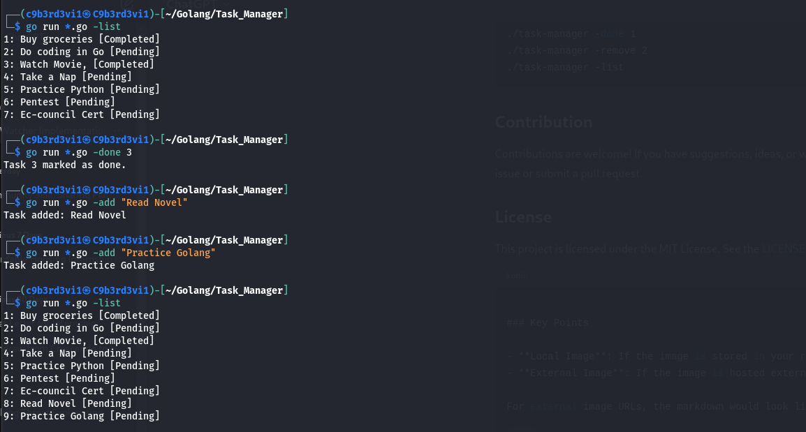
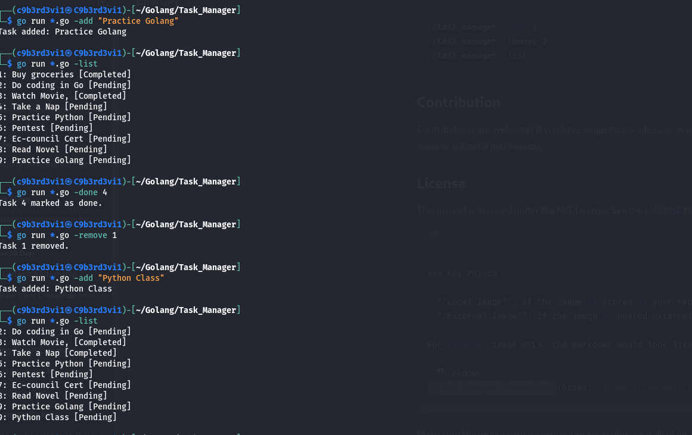
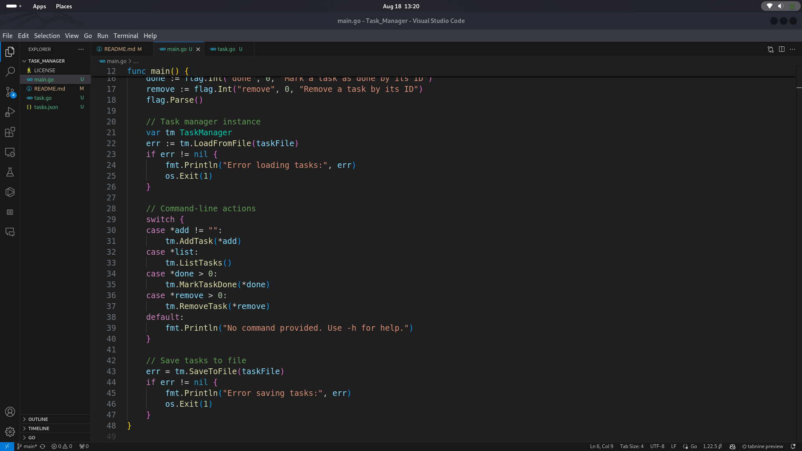
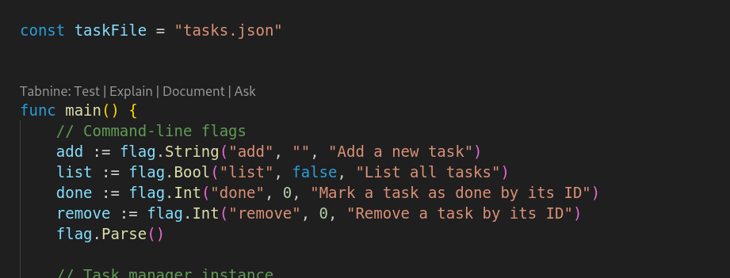

# Task Manager

A simple command-line tool written in Go to manage daily tasks. This tool allows you to add, list, mark as done, and remove tasks, all from your terminal. Tasks are saved to a JSON file, so your list persists between sessions.

## Features

- **Add Task**: Add a new task with the `-add` flag.
- **List Tasks**: List all tasks with the `-list` flag.
- **Mark Task as Done**: Mark a task as completed with the `-done` flag followed by the task ID.
- **Remove Task**: Remove a task with the `-remove` flag followed by the task ID.
- **Save and Load**: Tasks are automatically saved to and loaded from a `tasks.json` file.

## Installation

1. **Clone the repository**:

    ```bash
    git clone https://github.com/C9b3rD3vi1/Task_Manager.git
    cd Task_Manager
    ```

2. **Build the project**:

    ```bash
    go build -o Task_Manager
    ```

3. **Run the tool**:

    ```bash
    go run *.go -add "Buy groceries"
    go run *.go -list
    go run *.go -done 1
    go run *.go -remove 1
    ```

## Usage

### **Add a Task**

    go run *.go -add "Your task description"

### **List tasks**

    go run *.go -list

### **Mark tasks as done**

    go run *.go -done [task_id]

### **Remove a Task**

    go run *.go -remove [task_id]

### **Get a Help**

    go run *.go -h

### **Example Running**

    go run *.go -add "Complete Go project"
    go run *.go -add "Read a book"
    go run *.go -list
    go run *.go -done 1
    go run *.go -remove 2
    go run *.go -list

### **Contribution**

Contributions are welcome! If you have suggestions, ideas, or want to report a bug, please open an issue or submit a pull request.

### **License**

The project is licensed under the MIT License. See the LICENSE file for details.

### **Project working samples**





### **Terminal**




